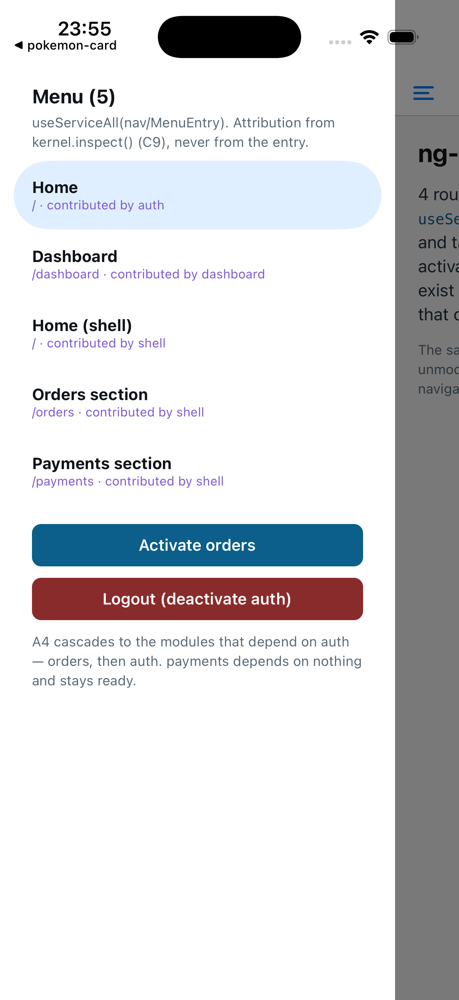
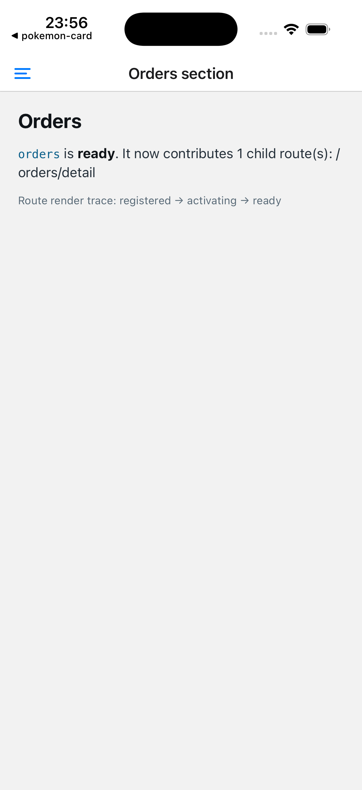
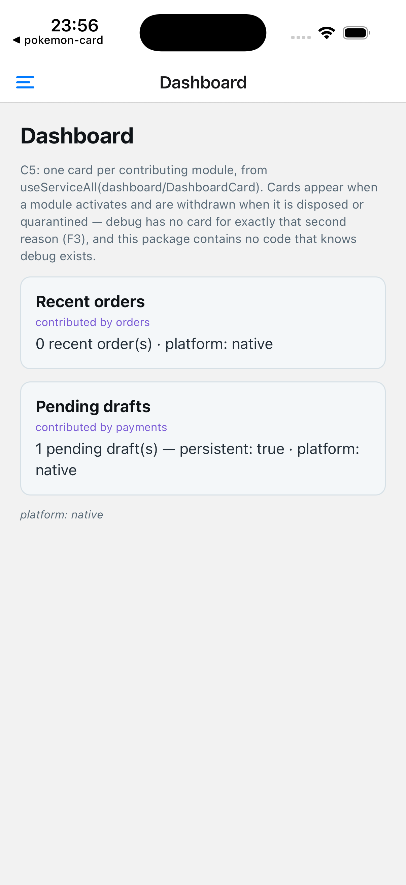
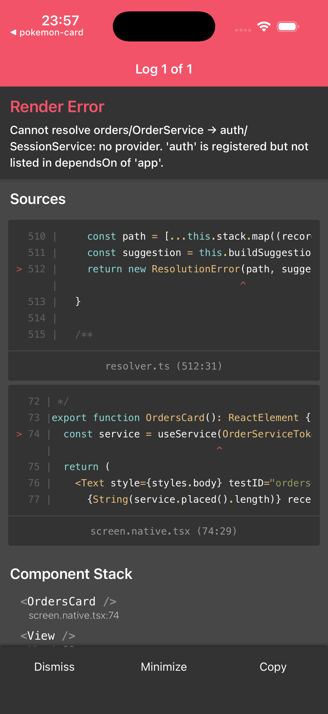
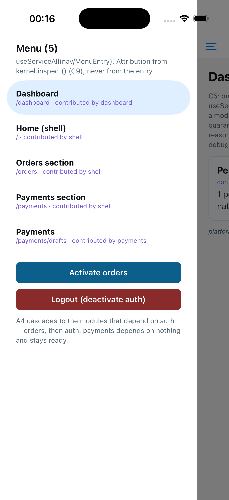
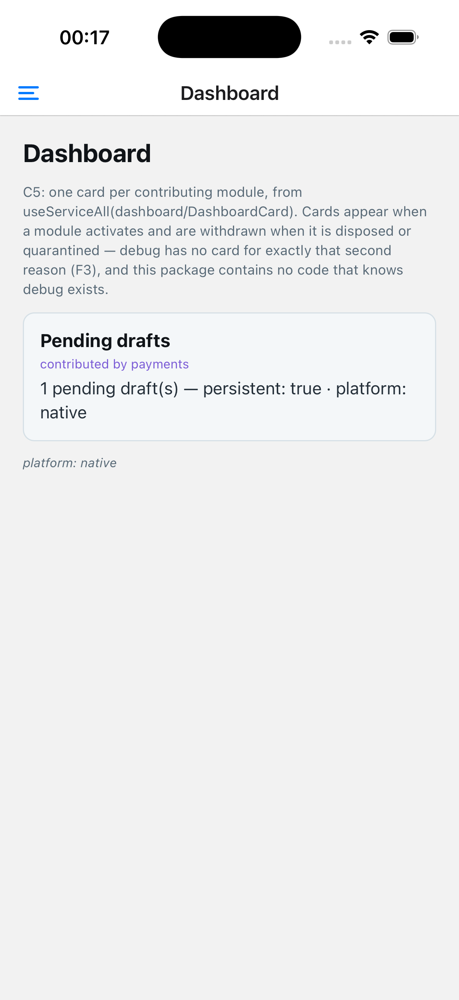

# Native device verification

Issue #60 was driven on an iPhone 17 Pro simulator running iOS 26.5, with
Expo SDK 57, React Native 0.86, and Metro on port 8083. The accessibility tree
was checked before every interaction; the screenshots below are paired with
the specific claim they prove.

## Drawer contributions

The initial drawer contains five live entries attributed to `auth`,
`dashboard`, and the native shell. The feature-owned `orders/detail` entry is
absent because the lazy orders module has not activated yet.

## Lazy route activation

Tapping the shell-owned **Orders section** route activates the lazy module and
renders its screen. The on-screen render trace records
`registered → activating → ready`; the middle render lasts only a few
milliseconds under Metro, so the trace is the durable evidence rather than an
artificially delayed screenshot.

## Dashboard quarantine behavior

The dashboard contains cards contributed by `orders` and `payments` and labels
both as `platform: native`. It contains no `debug` card because the failed debug
module is quarantined.

## Logout finding and correction

The first logout drive-through exposed a real defect: an offscreen orders route
automatically reactivated the module as soon as its status became `disposed`,
while the auth deactivation cascade was still running. Auth then completed its
teardown, leaving the newly reactivated `OrdersCard` without
`auth/SessionService` and producing the LogBox above.

Route rendering now activates only a never-started `registered` module.
Reactivating a deliberately disposed module remains an explicit user action in
the drawer, so logout cannot be undone by an offscreen route effect.

After the correction, logout completes with no LogBox. The drawer shrinks from
seven entries to five: `auth/home` and `orders/detail` are withdrawn, while the
shell entry routes and `payments/drafts` remain.

Returning to Dashboard shows only the persistent payments card. The orders card
is withdrawn, the debug card remains absent, and the native screen stays
renderable after the full deactivation cascade.
